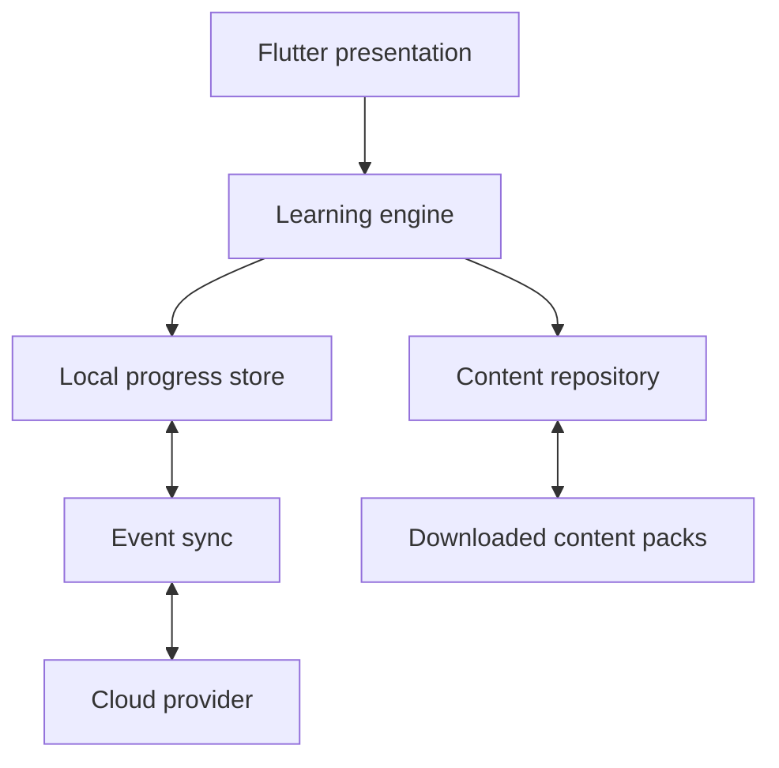

# Architecture

## Goals

ReMath must run offline on Android, iOS, Windows, and macOS; resume interrupted
sessions; synchronise progress optionally through a user-selected provider; and
support a substantial, independently versioned curriculum.

## System view



The learning engine consumes domain interfaces. It does not know whether data is
stored in SQLite, a file, or memory, nor whether cloud sync uses Google Drive,
OneDrive, or Dropbox.

## Layers

### Presentation

Responsive Flutter widgets and presentation state. Phone layouts prioritise one
question at a time; larger screens may show a concept card beside the question.
UI code may depend on domain use cases but not concrete persistence providers.

### Domain

Pure Dart entities and policies: skills, questions, sessions, attempts, mastery,
scheduling, marking, and deterministic generation. This is the most heavily
tested layer.

### Data

Repositories, local persistence, migrations, content-pack readers, and sync
adapters. DTOs are translated at the boundary rather than leaking into domain
models.

## Personal progress

The local store is always available and writes immediately. Important actions
produce immutable events with UUIDs. Examples include question attempted,
concept card viewed, hint used, session paused, and confidence recorded.

Cloud sync exchanges event batches and compact snapshots. Events are idempotent:
receiving the same event twice has no effect. Derived mastery and schedules can
be rebuilt from the event stream plus the algorithm version. A snapshot is a
performance optimisation, never the sole copy of unmerged activity.

Only one cloud provider is active at a time. The first planned adapters are:

- Google Drive application-data folder;
- OneDrive application folder;
- Dropbox application folder;
- encrypted file export/import.

Credentials remain in platform secure storage. Provider SDKs stay outside the
domain and sync-policy layers.

## Curriculum content

The app bundles a small foundation pack. Other packs are downloadable, signed,
compressed, independently versioned, cached locally, and safe to delete without
deleting progress.

Content sources are human-editable and compiled into a validated release format.
Text uses Markdown, equations use LaTeX, and diagrams prefer SVG. Videos remain
external links. Parameterised questions store templates and constraints rather
than enumerating every instance.

A generated question is reproduced from:

```text
(pack ID, template ID, template version, generator version, seed)
```

Curated JEE/Oxbridge-style problems are stored individually with structured
solutions, hints, prerequisites, and misconception tags.

## Security and privacy

- No paid AI or network dependency in the core learning loop.
- Least-privilege OAuth scopes for optional sync.
- No secrets or provider tokens in logs, analytics, content packs, or source.
- No behavioural analytics by default.
- Exported backups will support encryption before containing sensitive notes.

## Decisions deferred

Concrete state-management, database, secure-storage, OAuth, and equation-renderer
packages will be selected through small platform-tested spikes. Keeping domain
contracts package-neutral prevents early package choices becoming architecture.
